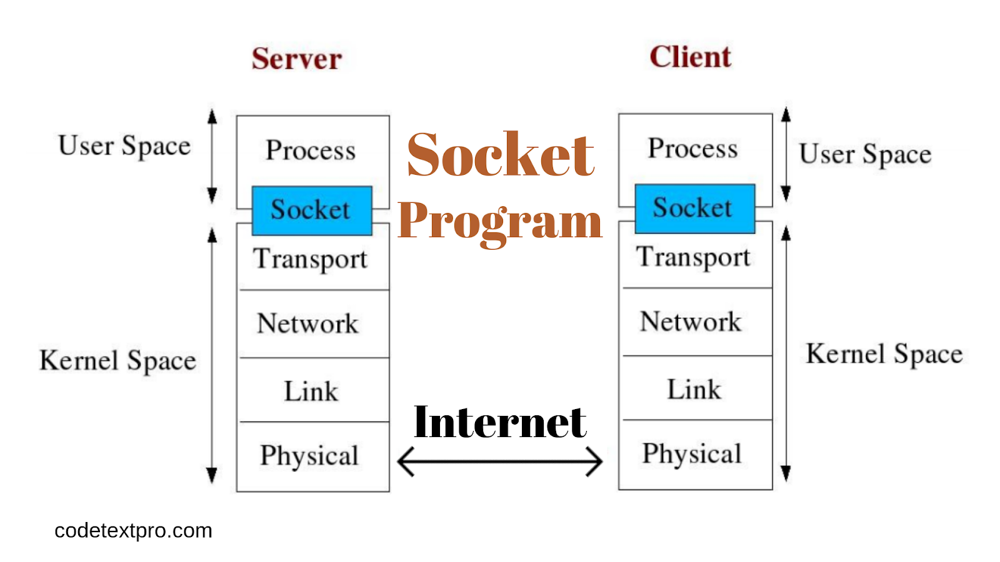

## ft_irc
### What is IRC Protocol?
	IRC(Internet Relay Chat)とは、インターネットを通じて複数の利用者がリアルタイムに文字メッセージを交換することができるチャットシステム。また、そのための通信プロトコル（通信規約）。
	サーバを介してクライアントとクライアントが会話をする枠組みで、インスタントメッセンジャーのプロトコルの1つに分類される。
	相手との通信の基本はテキスト（文章）によるやりとりであるが、IRCクライアントによっては、ファイル転送機能を持っていたり、TLSによる暗号化が行われる場合もある。
	URL:
	https://postd.cc/irc-is-dead-long-live-irc/
	https://www.rfc-editor.org/rfc/rfc2812

### Advantages
	- 会社がないため、誰でも自分のサーバーを立ち上げ、好きなように利用できる（分散型）
	- 一度に最大数百人とリアルタイムでディスカッションできるため、非常に柔軟で堅牢

### Recent uses of IRC
	ネット犯罪やサイバー攻撃を行う際に、外部から不正にコンピューターに指示（コマンド）を送ったり制御（コントロール）を行う際の通信手段として、しばしば用いられる。
	特にDDoS攻撃などにおいては、ボットネットを攻撃側が構築して登録されているボット化した各コンピューターが一斉に標的に攻撃を実行するが、この際に攻撃者から各ボットへの指示を出すためにIRCが用いられる。
	URL:
	https://eset-info.canon-its.jp/malware_info/term/detail/00007.html
	https://thehackernews.com/2022/01/ddos-irc-bot-malware-spreading-through.html

### What is DDos attack(Denial of Service attack)?
	ウェブサイトやサーバーに対して過剰なアクセスやデータを送付するサイバー攻撃。
	DDoS攻撃は、コンピューターシステムへの不正侵入、プログラムの破壊、データ改ざんといった行為をする攻撃者が、複数の一般コンピューターを乗っ取って行います。
	DDoS攻撃を受けると、サーバーやネットワーク機器などに対して大きな負荷がかかるため、ウェブサイトへのアクセスができなくなったり、ネットワークの遅延が起こったりします。その結果、対象とされた企業や組織では、金銭面だけでなく信用面でも大きなダメージを被ることになります。

### Internet Relay Chat Structure
	URL:
	http://chi.cs.uchicago.edu/chirc/irc_examples.html
	https://sacraya.610t.org/Press/No3/c2.html

### Socket Programing
	ソケットとは、ユーザにとってのデータの出入り口。
	ユーザはソケットに対してデータを書き込んだり読み込んだりするだけで通信が行える。ソケットは、2つ以上のソケットが互いに関係を持つことではじめて有効になる。

	URL:
	https://qiita.com/Michinosuke/items/0778a5344bdf81488114
	https://tora-k.com/2019/08/27/socket-c/
	https://developers.wonderpla.net/entry/2017/08/23/184106
	https://www.educba.com/socket-programming-in-c-plus-plus/
	http://research.nii.ac.jp/~ichiro/syspro98/server.html

### IRC Client Reference
	https://irssi.org/
	https://wiki.archlinux.jp/index.php/Irssi#.E3.82.A4.E3.83.B3.E3.82.B9.E3.83.88.E3.83.BC.E3.83.AB

### Blocking I/O
	ブロッキングI/O(同期I/O)ではI/O処理時に対象のファイルディスクリプタが準備完了になっていない場合、ブロック状態、つまりプロセスはシステムコールの返答待ち状態になり張り付く。その間プログラムの処理が進むことはない。

### Non Blocking I/O
	ノンブロッキングI/OではI/O対象のファイルディスクリプタの準備完が了していないことをアプリケーション側に伝えるため即座にエラーが返る(errnoにEGAINが格納されて返ってくる)。
	一般に、O_NONBLOCKフラグを利用してノンブロッキングモードを宣言するが、この時プロセスはブロック状態にならず、CPUを他の処理に回すことができるためI/O待ち時間を有効活用できる。
	エラーはアプリケーション側でハンドリングしてリトライするタイミングを定義する必要がある。ノンブロッキングI/Oはソケットなどのネットワークに用いられるI/OモデルでディスクI/Oには使わない。
	C10K問題の対策としてノンブロッキングI/O+イベントループモデルを採用することでシングルスレッドで複数の接続を処理する方法がある。

	
### 非同期I/O(Asynchronous I/O)
	I/O処理が完了したタイミングで通知するI/Oモデルを非同期I/Oという。
	非同期I/Oは、通知はシグナルもしくはコールバックによって行われ、通知があるまではアプリケーション側で他の処理を進めることができる。プロセスがブロック状態にならない点ではノンブロッキングI/Oと一緒だが、非同期I/OはI/Oの処理が完了したら通知をし、ノンブロッキングI/OはI/O処理が可能な状態にないことをエラーで通知するので動きは異なる。

### Difference between Non Blocking I/O and Asynchronous I/O ?
	ノンブロッキングI/Oは処理がすぐできない時はエラーを返し、ブロック状態にさせない方式。
	一方、非同期I/Oは処理がすぐできない時は処理が完了するまでバックグラウンドで待機して、終了したタイミングで通知を返す方式(通知が来たら既に処理が終わっている)。

### I/O 多重化(I/O Multiplexing)
	I/O多重化とはpoll()、select()、epollシステムコールを利用して、複数のファイルディスクリプタを1つのプロセスで管理すること。
	これらのシステムコールはファイルディスクリプタの状態変化を監視できるため、複数のファイルディスクリプタのいずれかが入出力準備が完了したかわかる

### Difference between select poll epoll

####  select()
	監視対象のファイルディスクリプタn個をループの中で1つずつ状態確認する。そのため，計算量的には*O(n)*になる．また，扱えるファイルディスクリプタの数に上限があるため、現在はこのシステムコールを積極的に利用する理由は特にない。

#### poll()
	selectで問題だったファイルディスクリプタの数が無制限になっている。しかし，select同様監視対象のファイルディスクリプタを1つずつ状態確認するため、その計算量は*O(n)*となる。そのため、ファイルディスクリプタの数が増えるとパフォーマンスが低下する。

#### epoll()
	epollはファイルディスクリプタの数に制限が無いのに加えて、ファイルディスクリプタの状態変化監視も改善されている。具体的には，ファイルディスクリプタの状態をカーネルで監視しており、変化したものを直接通知できるためselect、pollの時のようにループを使った監視をする必要がない。
