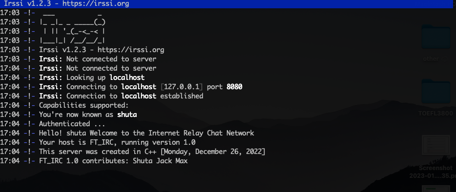

<h1 align="center">
	FT_IRC
</h1>

## The Project
> this project is about creating my own IRC server

## Get Started

Do `make` and then run :

```bash
./ircserv <port> <password>
```

Or you could also do `make run` which directly starts the server on the port 8080 and with the password password.


